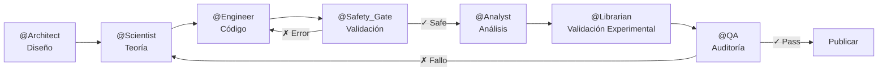

# Antigravity Nano Research Multiagentic Core

[](https://github.com/Multiagent-AI-Lab/Antigravity-Nano-Research-Multiagentic-Core/actions/workflows/ci.yml)
[](https://multiagent-ai-lab.github.io/Antigravity-Nano-Research-Multiagentic-Core/)
[](https://opensource.org/licenses/Apache-2.0)
[](https://github.com/google-deepmind/antigravity)
[](https://www.python.org/downloads/)
[](https://github.com/ljyudico)

> **Marco de Investigación para Sistemas Multi-Agente de IA en Ciencias Computacionales**

Desarrollado por **[@ljyudico](https://github.com/ljyudico)** usando [Antigravity](https://github.com/google-deepmind/antigravity) como entorno de desarrollo multi-agente.

---

## 🎯 ¿Qué Problema Resuelve?

La adopción de sistemas multi-agente basados en modelos de lenguaje grandes (LLMs) en investigación científica computacional enfrenta **tres barreras críticas**:

1. **Fragmentación de Frameworks** — Los investigadores deben elegir entre LangGraph, CrewAI, AutoGen, smolagents y otros sin comparación sistemática ni guía de selección, limitando la adopción informada.

2. **Brecha de Integración de Dominio** — Los frameworks de agentes de propósito general carecen de integración con herramientas científicas de dominio (simuladores atomísticos, bases de datos de materiales, pipelines espectroscópicos), mientras que las plataformas científicas especializadas no proveen capacidades de orquestación multi-agente.

3. **Accesibilidad Económica** — La mayoría de las implementaciones asumen acceso a APIs de pago, excluyendo instituciones sin presupuesto dedicado e impidiendo investigación reproducible a escala.

## 💡 ¿Qué Aporta Este Framework?

**Antigravity Nano Research Multiagentic Core** es una infraestructura de investigación modular que resuelve estas barreras proporcionando:

### Contribuciones Principales

✅ **Integración Multi-Framework** — Interfaz unificada para 7 frameworks de orquestación de agentes (LangGraph, CrewAI, Google ADK, smolagents, AutoGen, LangChain, MetaGPT) con benchmarks sistemáticos de rendimiento

✅ **Modelo de Gobernanza de 7 Agentes** — Metodología de desarrollo formal con bucles de retroalimentación estructurados (L1: validación de seguridad, L2: comparación experimental, L3: auditoría de calidad)

✅ **Arquitectura Agnóstica de Dominio** — Diseño modular donde **los componentes de infraestructura (orquestación multi-agente, Graph RAG, servidores MCP) se transfieren a cualquier dominio de ciencias computacionales** reemplazando únicamente los módulos específicos del dominio

✅ **Accesibilidad de Costos** — Currículum completo ejecutable por <$2 USD usando OpenRouter, o $0 con inferencia local Ollama. Demo sin costo (nanocluster Au₁₃) no requiere API keys.

✅ **Skills Listas para Producción** — 13 módulos versionados de External Skills proporcionando validación científica, enrutamiento LLM y observabilidad

✅ **Currículum Educativo Completo** — 25 notebooks Jupyter (6 unidades) cubriendo modelado a nanoescala, simulación molecular, aprendizaje automático y sistemas multi-agente

### 🌍 Transferibilidad de Dominio

**Demostrado en:** Nanotecnología computacional (Materials Project API, ASE, RDKit)

**Transferible a:**
- **Bioinformática** — Reemplazar con herramientas BioPython, UniProt, PDB
- **Química Cuántica** — Reemplazar con benchmarks Psi4, PySCF, CCSD(T)
- **Ciencia del Clima** — Reemplazar con modelos climlab, CESM, CMIP6

La capa de orquestación multi-agente, backends Graph RAG y modelo de gobernanza permanecen sin cambios.

---

## 🚀 Quick Start (3 Pasos)

> [!NOTE]
> Este repositorio fue desarrollado usando [Antigravity](https://github.com/google-deepmind/antigravity) como entorno de trabajo. **No necesitas Antigravity** para ejecutar los notebooks — solo conda y las dependencias del entorno `ia_nano`.

### 1. Clonar el Repositorio

```bash
git clone https://github.com/Multiagent-AI-Lab/Antigravity-Nano-Research-Multiagentic-Core.git
cd Antigravity-Nano-Research-Multiagentic-Core
```

### 2. Ejecutar Setup Automático

**Windows**:
```batch
setup.bat
```

**Linux/macOS**:
```bash
chmod +x setup.sh
./setup.sh
```

Este script:
- ✅ Crea el ambiente conda `ia_nano` (Python 3.11)
- ✅ Instala todas las dependencias científicas (ASE, RDKit, OpenMM)
- ✅ Registra el kernel Jupyter
- ✅ Verifica la instalación

### 3. Activar el Consejo de Expertos

```bash
conda activate ia_nano
jupyter lab
```

Ahora puedes trabajar con el sistema multi-agente exactamente como se usa en este proyecto.

---

## 🏗️ Arquitectura del Sistema

Este proyecto implementa un **Consejo de 7 Expertos** especializados:



### Agentes y sus Roles

| Agente | Responsabilidad | External Skills |
|--------|----------------|-----------------|
| **@Architect** | Guardián de la estructura y memoria del proyecto | `senior-architect`, `agent-memory-systems` |
| **@Scientist** | Dueño de la teoría, notación LaTeX perfecta | `claude-scientific-skills`, `research-engineer` |
| **@Engineer** | Constructor del código, implementación | `python-pro`, `ml-pipeline-workflow` |
| **@Safety_Gate** | Validación numérica, toxicología, pedagogía | `stability_guardian`, `toxicity_predictor`, `socratic_debugger` |
| **@Analyst** | Análisis profundo y visualización | `data-storytelling`, `descriptor_miner` |
| **@Librarian** | Validación experimental (Materials Project) | `librarian_rag` |
| **@QA** | Auditor supremo de calidad | `systematic-debugging`, `code-review-excellence` |

### 📊 Benchmarks de Frameworks Multi-Agente

Comparación sistemática de 7 frameworks en pipeline Au₁₃ (token usage, latencia, tasa de éxito, costo):

<p align="center">
  
</p>

**Hallazgos clave:**
- **smolagents** logra el menor uso de tokens (87K) y latencia (12.5s)
- **LangGraph** y **Google ADK** ofrecen la mejor confiabilidad (100% éxito)
- **MetaGPT** tiene el mayor overhead de coordinación
- Ver detalles cuantitativos en [paper/latex/tables/table6_frameworks.tex](paper/latex/tables/table6_frameworks.tex)

### 🗄️ Selección de Backend Graph RAG

Árbol de decisión para elegir entre NetworkX, Kùzu, Neo4j y Graphiti según volumen de datos y restricciones de despliegue:

<p align="center">
  
</p>

**Guía de selección:**
- **NetworkX**: Prototipos <10K nodos, cero configuración
- **Kùzu**: Investigación local embebida <1M nodos
- **Neo4j**: Producción >1M nodos, alta concurrencia
- **Graphiti**: Memoria episódica temporal para agentes de larga duración
- Ver comparación detallada en [paper/latex/tables/table5_graphrag.tex](paper/latex/tables/table5_graphrag.tex)

---

## 📦 Requisitos del Sistema

### Obligatorios

- **Python 3.11** - [¿Por qué 3.11?](#por-qué-python-311)
- **Conda/Miniconda** - Gestor de ambientes
- **Git** - Control de versiones

### Opcionales

- **[Antigravity](https://github.com/google-deepmind/antigravity)** - Entorno multi-agente usado durante el desarrollo (no requerido para ejecutar los notebooks)
- **Node.js** - Para MCP servers (Materials Project integration)
- **CUDA** - Para aceleración GPU en OpenMM

---

## 📚 Documentación

- **[GOVERNANCE.md](GOVERNANCE.md)** - Roles del Consejo de Expertos y pipeline de trabajo
- **[INSTALL.md](INSTALL.md)** - Guía detallada de instalación y troubleshooting
- **[CONTRIBUTING.md](CONTRIBUTING.md)** - Cómo contribuir al proyecto
- **[SKILLS_ATTRIBUTION.md](SKILLS_ATTRIBUTION.md)** - Créditos y origen de las skills externas

---

## 🧬 External Skills

Este proyecto incluye **skills modulares** desarrolladas específicamente para validación científica:

### Numerical Skills
- `stability_guardian.py` - Validador de timesteps para MD
- `basis_set_architect.py` - Recomendador de bases Gaussianas para DFT

### AI Mining Skills
- `toxicity_predictor.py` - Predictor de toxicidad molecular

### Pedagogy Skills
- `socratic_debugger.py` - Generador de feedback pedagógico

### Orchestration Skills
- `librarian_rag.py` - RAG para validación experimental

Ver [SKILLS_ATTRIBUTION.md](SKILLS_ATTRIBUTION.md) para detalles completos.

---

## 📖 Contenido Educativo

Este repositorio incluye **material educativo estructurado** para aprender IA aplicada a Nanotecnología:

### ✅ Unidad 1: Modelado a Nanoescala
- Fundamentos de simulación molecular
- Atomic Simulation Environment (ASE)
- Optimización de nanopartículas de oro
- Análisis estructural (RDF, coordinación)
- **[📓 Ir a la Unidad 1](educational_content/unit_01_nanoscale_modeling/)**

### ✅ Unidad 2: Simulación Molecular Avanzada (2 notebooks)
- Dinámica Molecular (MD) con diferentes potenciales
- Teoría del Funcional de la Densidad (DFT)
- Optimización de estructuras y propiedades electrónicas
- Nanofabricación computacional
- **[📓 Ir a la Unidad 2](educational_content/unit_02_molecular_simulation/)**

### ✅ Unidad 3: Machine Learning para Nanomateriales (4 notebooks)
- Algoritmos clásicos (Random Forest, SVM, regresión, Gradient Boosting)
- Redes neuronales profundas en PyTorch (backpropagación simbólica, GCN)
- Transfer Learning, Knowledge Distillation, Reinforcement Learning (DQN)
- Feature engineering y descriptores moleculares
- **[📓 Ir a la Unidad 3](educational_content/unit_03_ml_nanomaterials/)**

### ✅ Unidad 4: IA Aplicada a Nanotecnología (2 notebooks)
- LLMs y Generative AI para ciencia de materiales (Materials Project API)
- Computer Vision para microscopía SEM/TEM
- Análisis espectroscópico y series temporales con IA
- Optimización bayesiana y algoritmos evolutivos
- **[📓 Ir a la Unidad 4](educational_content/unit_04_applied_ai/)**

### ✅ Unidad 5: Sistemas Multi-Agente (9 notebooks)
- LangChain, LangGraph, CrewAI, Google ADK 1.0 + protocolo A2A
- RAG, GraphRAG, Mem0, ChromaDB
- Producción: FastAPI, observabilidad, model routing multi-proveedor
- **[📓 Ir a la Unidad 5](educational_content/unit_05_multi_agent_sys/)**

### ✅ Unidad 6: Proyecto Integrador (6 notebooks)
- Pipeline de proyecto científico end-to-end (propuesta → implementación → despliegue → evaluación)
- FastAPI template (`mi_proyecto_api/`) con Dockerfile listo para adaptar
- Scaffolding guiado: JSON de propuesta, plan técnico y reporte final
- **[📓 Ir a la Unidad 6](educational_content/unit_06_integration_project/)**

**[📚 Ver todo el contenido educativo](educational_content/)**

---

## 📚 Documentación

- **[GOVERNANCE.md](GOVERNANCE.md)** - Roles del Consejo de Expertos y pipeline de trabajo
- **[INSTALL.md](INSTALL.md)** - Guía detallada de instalación y troubleshooting
- **[CONTRIBUTING.md](CONTRIBUTING.md)** - Cómo contribuir al proyecto
- **[SKILLS_ATTRIBUTION.md](SKILLS_ATTRIBUTION.md)** - Créditos y origen de las skills externas

---

## ❓ Por qué Python 3.11?

En el ecosistema científico, la **estabilidad** es tan crítica como el rendimiento:

1. **Compatibilidad Crítica**: Librerías fundamentales como `RDKit`, `ASE` y `OpenMM` tienen soporte nativo extremadamente estable en 3.11
2. **Rendimiento vs. Estabilidad**: Python 3.11 introdujo mejoras significativas de velocidad (Specializing Adaptive Interpreter) respecto a 3.10
3. **Reproducibilidad**: Al fijar esta versión, garantizamos que los notebooks sean ejecutables por estudiantes e investigadores en cualquier sistema operativo sin "infiernos de dependencias"

| Librería | Python 3.10 | Python 3.11 | Python 3.12 |
|----------|-------------|-------------|-------------|
| RDKit    | ✓ Estable   | ✓✓ Óptimo   | ⚠️ Beta      |
| ASE      | ✓           | ✓✓          | ✓           |
| OpenMM   | ✓           | ✓✓          | ❌          |

---

## 🤝 Contribuciones

¡Las contribuciones son bienvenidas! Por favor lee [CONTRIBUTING.md](CONTRIBUTING.md) antes de enviar un Pull Request.

### Áreas de Contribución

- 🔬 Nuevas skills para validación científica
- 📊 Mejoras en visualización de datos
- 🧪 Casos de prueba adicionales
- 📖 Documentación y tutoriales

---

## 📄 Licencia

Este proyecto está bajo la licencia **Apache-2.0**. Ver [LICENSE](LICENSE) para más detalles.

La licencia Apache-2.0 permite:
- ✅ Uso comercial
- ✅ Modificación
- ✅ Distribución
- ✅ Uso de patentes
- ⚠️ Requiere: Atribución y aviso de licencia

---

## 🔗 Enlaces Útiles

- [Antigravity Documentation](https://github.com/google-deepmind/antigravity)
- [Materials Project](https://materialsproject.org/)
- [ASE Documentation](https://wiki.fysik.dtu.dk/ase/)
- [RDKit Documentation](https://www.rdkit.org/docs/)

---

## 📧 Contacto

**Mantenedor**: ljyudico  
**GitHub**: [@ljyudico](https://github.com/ljyudico)

---

<div align="center">
  <sub>Desarrollado con ❤️ usando Antigravity para la investigación en Nanotecnología e IA</sub>
</div>
